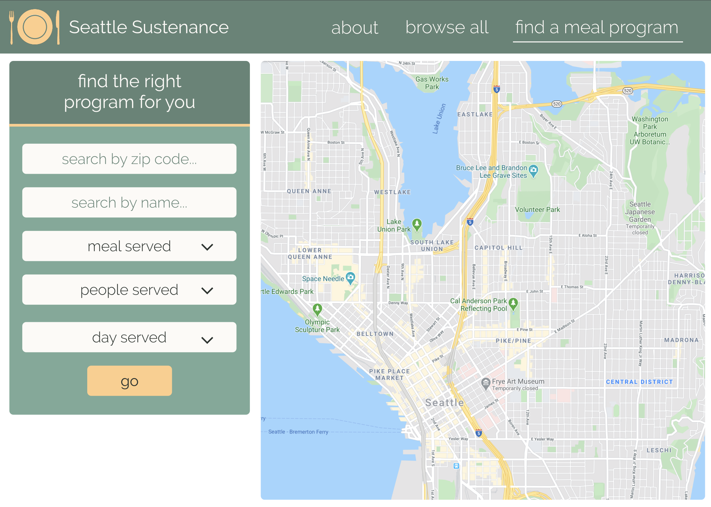
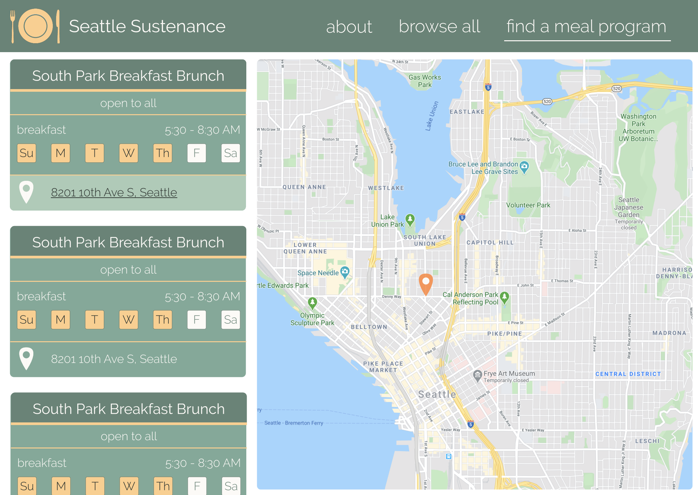
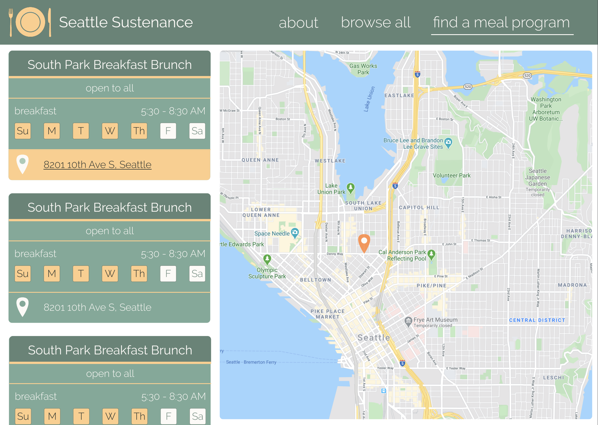
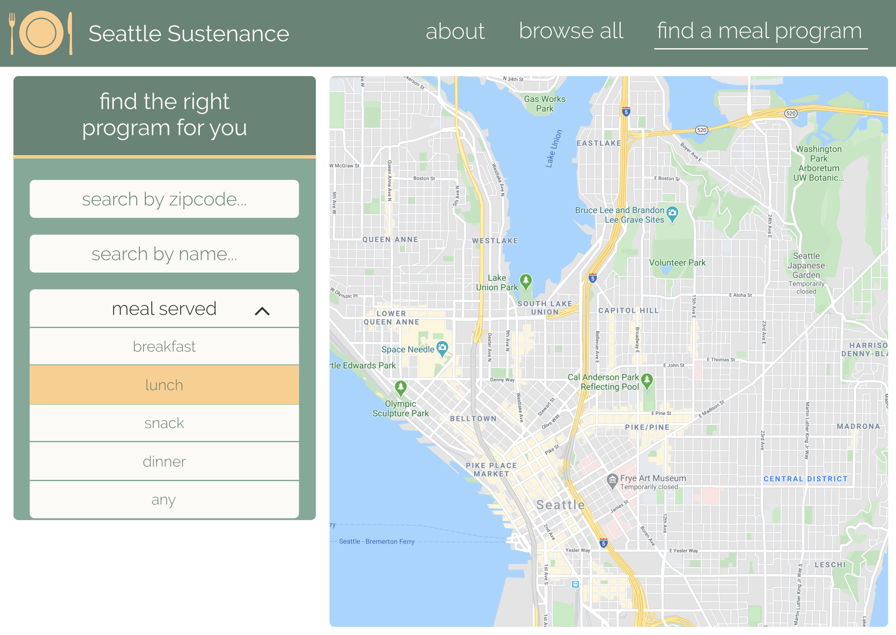

# Design

## Problem Statement:

Homeless and low-income residents of Seattle are often faced with the challenge of acquiring their next meal, often not having access to information that can provide locations serving this need. This challenge exacerbates an already dire situation that can lead to diminished health and the possibility of starvation. 

What makes food insecurity difficult to solve is its underlying causes—poverty, income inequality, and lack of affordable housing. Consequently, hunger often precedes homelessness because people who are forced to decide between paying for housing or groceries will, more often than not, choose the former. 1 in 10 Washington citizens struggle with hunger on a daily basis and we would like to provide a resource that helps them have an equal opportunity to a meal.

For those impacted by hunger free meal services do exist, however; even these services can prevent certain individuals from receiving a meal. Meal services are not created equal and many come with a set of requirements to get access. These requirements can range from ethnicity to age and might only be available upon arrival to the facility, leaving those that don’t fit the requirements to continue looking for a meal. 

Sources:

WA Hunger Facts. (2019, October). Retrieved April 12, 2020, from https://www.northwestharvest.org/wa-hunger-facts

Seattle, C. of. (2019, April 5). Meals Programs in Seattle: City of      Seattle Open Data portal. Retrieved April 12, 2020, from              https://data.seattle.gov/Community/Meals-Programs-in-Seattle/hmzu-x5ed

## Solution:
 
We are striving to create a website wherein low-income residents of King County, the homeless population, or advocates of these communities, may access critical information pertaining to meal programs. Our website will be a platform for which these groups of people can efficiently identify meal programs they are eligible for, or which suit their needs best. Users of the website will be able to find meal programs right for them by searching by zip code, name, or filtering based on the people served, meal served, or day of the week. Results will be based on the users’ filtering preferences and provide more detailed information, such as, the exact time of day food is being served and the location of the facility with an accompanying map/directions.
 
The main function, “find a meal program,” displays a map of King County with search and filtering capabilities to the left:

The left window on the screen allows the user to locate programs based on name or zipcode as well as filter programs, since some meal programs are limited to certain meal types, ages, and ethnicity.

Once the user has chosen their filters, it will display locations that are nearby the zip code they entered on the previous screen. The details that are displayed include the different types of meals, what days and time they are serving them, restrictions, and the location. 

Once the user selects a meal program location, a pin drop will appear on the map. At this point, we hope to be able to display more details about the location when clicked, or give directions if time permits during development.
